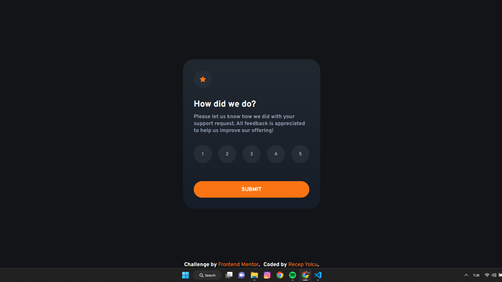

# Frontend Mentor - Interactive rating component solution

This is a solution to the [Interactive rating component challenge on Frontend Mentor](https://www.frontendmentor.io/challenges/interactive-rating-component-koxpeBUmI). Frontend Mentor challenges help you improve your coding skills by building realistic projects. 

## Table of contents

- [Overview](#overview)
  - [The challenge](#the-challenge)
  - [Screenshot](#screenshot)
  - [Links](#links)
- [My process](#my-process)
  - [Built with](#built-with)
  - [What I learned](#what-i-learned)
  - [Continued development](#continued-development)
  - [Useful resources](#useful-resources)
- [Author](#author)
- [Acknowledgments](#acknowledgments)

**Note: Delete this note and update the table of contents based on what sections you keep.**

## Overview

### The challenge

Users should be able to:

- View the optimal layout for the app depending on their device's screen size
- See hover states for all interactive elements on the page
- Select and submit a number rating
- See the "Thank you" card state after submitting a rating

### Screenshot




### Links

- Solution URL: [Add solution URL here](https://your-solution-url.com)
- Live Site URL: [Add live site URL here](https://your-live-site-url.com)

## My process

### Built with

- Semantic HTML5 markup
- CSS custom properties
- Flexbox
- Javascript

### What I learned

I learned using flex layout and js changing html elements style attributes 

```css

```
```js
function rateGet() {
    rate.innerHTML = selectedBtn;
    rateBox.style.display = "none";
    thankYouBox.style.display = "flex";
}
```

### Continued development

-

### Useful resources

- [Example resource 1](https://www.w3schools.com/) - So usefull website you can find anything you want in html,css,javascript etc.
- [Example resource 2](https://www.youtube.com/) - And you can find any problem you stuck on at youtube too 
- [Example resource 2](https://developer.mozilla.org/) 
- [Example resource 2](https://coolors.co/) - for color editing

## Author

- Website - [Recep Yolcu](https://recepyolcu.github.io/)
- Frontend Mentor - [@Recepyolcu](https://www.frontendmentor.io/profile/Recepyolcu)
- LinkedIn - [@recep yolcu](https://www.linkedin.com/in/recep-yolcu-61b3b11b2/)


## Acknowledgments

Thanks for https://www.w3schools.com/
